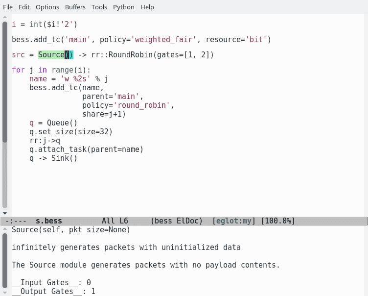
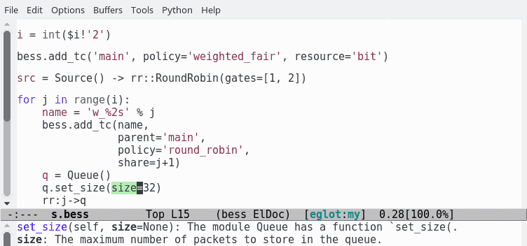
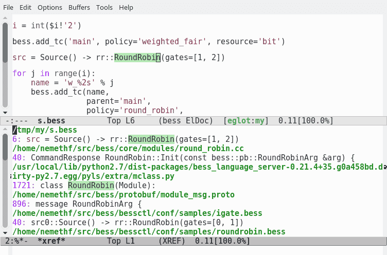
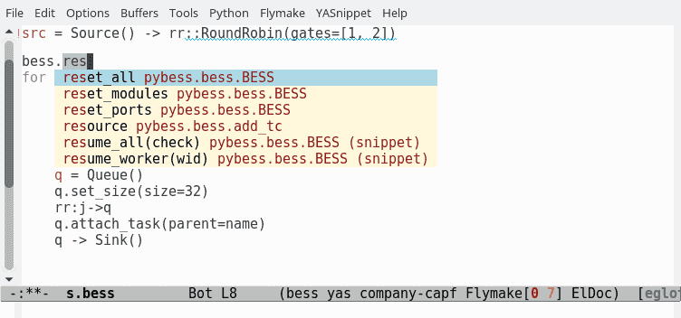
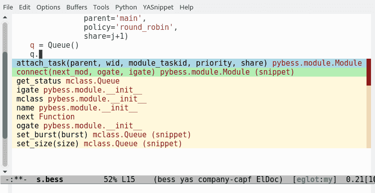

Bess plugin for pyls
====================


pyls-bess is a simple plugin for
[pyls](https://github.com/palantir/python-language-server).

The [Bess](https://github.com/NetSys/bess) scripting/configuration
language is basically python with some syntactic sugar and global
variables.  pyls-bess relies on
[bess-gen-doc](https://github.com/nemethf/bess-gen-doc) for the global
variables (see [mclass.py](pyls_bess/bess_doc/mclass.py) and
[mclass.min.json.gz](pyls_bess/bess_doc/mclass.min.json.gz)).  It uses
very simple heuristics to understand the syntactic sugar.

pyls-bess should work with any text editor supporting the [language
server protocol](https://langserver.org/), however I only tested it
with emacs/[eglot](https://github.com/joaotavora/eglot).

## Features

* Documentation help of a bess module

  

* Documentation help for a method argument

  

* Jump to definition / references.  In case of multiple references, the
  default order of the references is "project", "cpp_definition",
  "mclass", "protobuf", "examples".

  

* Completion of the global variable `bess`

  

* Completion of a module instance

  
  
  
* Type checking with [mypy](https://github.com/tomv564/pyls-mypy)

  The mypy plugin detects that `Queue().get_status()['dequeue']` is
  incorrect because the return value of `get_status` has no key
  `dequeue`.  Pyls, however, cannot currently complete the possible
  keys.  Moreover, completing `Queue().get_status().` incorrectly
  lists the possible dictionary keys as properties.  But at least it
  helps to find out `dequeue` should be changed to `dequeued`.

  
## Installation

Install with `python setup.py install`.

## Configuration

pyls-bess defines three configuration variables.

`bess.source_directory` sets the location of bess itself.  If this
varialbe is not set, pyls-bess falls back to the BESS environment
variable.

`bess.definitions` and `bess.refereneces` define lists of reference
types.  The server searches for definitions/references considering the
lists in order.  The possible reference types are `project`,
`cpp_definition`, `mclass`, `protobuf`, and `examples`.

The bess-specific configuration variables can be append to an existing
setup.cfg, tox.ini, or pycodestyle.cfg file.  Alternatively, it can be
placed in a separate .bessls file at the root of the project, or in a
user-level configuration file named bessls in
[XDG_CONFIG_HOME](https://specifications.freedesktop.org/basedir-spec/basedir-spec-0.8.html)
(usually ~/.config).  With the following example, pyls-bess searches
the current project (workspace) and then the module_msg.proto file for
references.  If bessls found references in the proto file it returns
the file as /opt/bess/protobuf/module_msg.proto.

```
[bess]
references = project, protobuf
source_directory = /opt/bess
```

## Configuration of Emacs/eglot

Adding the following lines to the [Emacs initialization
file](https://www.gnu.org/software/emacs/manual/html_node/emacs/Init-File.html)
is enough.

```elisp
(setenv "BESS" "/opt/bess")

(define-derived-mode bess-mode python-mode "bess")
(add-to-list 'auto-mode-alist '("\\.bess\\'" . bess-mode))
(with-eval-after-load 'eglot
  (add-to-list 'eglot-server-programs '(bess-mode . ("pyls"))))
```
